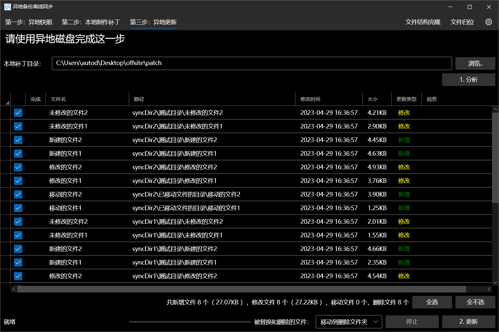

# 异地备份离线同步

在双方无法通过网络或实地同步的情况下，使用增量同步的方式，利用小容量设备完成异地和本地磁盘的数据同步

## 为谁开发？

- 如果你有重要数据，因此建立了异地备份
- 如果你的异地备份仅仅是单独放置、不连接网络的硬盘
- 如果你需要对异地备份硬盘需要进行定期同步，但又不想每次带着这些异地备份硬盘到本地来同步

## 步骤

1. **在异地**，建立异地硬盘的目录结构快照
2. **在本地**，将异地目录结构与本地进行对比，寻找差异部分，准备需要新增/更新/删除的文件
3. **在异地**，将更新文件应用到异地备份硬盘。

## 举例

### 情形

假设目前有这样一个情形：

在本地计算机A上，有如下目录结构：

- D:\
  - **文档**
  - 程序
  - 视频
  - ...
- E:\
  - 个人文件
    - 游戏
    - **音乐**
    - **照片**
  - ...

在异地计算机B上，有如下目录结构：

- D:\
  - 程序
  - 备份文件
    - **文档**
    - **音乐**
    - 电影
  - ...
- E:\
  - **照片**
  - ...

其中，粗体部分是需要同步的部分。也就是说，我们需要同步三个目录，分别是`文档`、`音乐`、`照片`。

以A为例，可以看到`文档`位于`D:\`中，而`音乐`和`照片`位于`E:\个人文件`中。我们称`文档`、`音乐`、`照片`为**待同步目录**，而`D:\`和`E:\个人文件`为搜索目录或**顶级目录**。

### 第一步：异地快照

首先，需要为异地计算机A创建快照。在快照创建完成之后，到第三步异地更新之前，**异地的目录文件结构不应发生改变**，否则可能出现意外情况。

1. 在搜索目录文本框中输入或浏览选择`D:\备份文件`，此时“待添加目录”列表中会出现D盘备份文件目录下的所有子目录，勾选`文档`和`音乐`目录，右侧“需要同步的目录”中会同步出现该目录
2. 在搜索目录文本框中输入或浏览选择`E:\`，此时“待添加目录”列表中会出现E盘下的所有子目录，勾选`照片`目录，右侧“需要同步的目录”中会同步出现该目录
3. 单击`导出快照`，选择目标快照位置进行导出。也可先设置快照文件位置，后单击按钮。

### 第二步：本地制作补丁

在得到异地快照后，需要在本地计算机B对比与A的磁盘中的目录与文件的差异，并生成补丁。

1. 选择异地快照文件，即刚刚生成的文件。
2. 设置本地搜索目录，在文本框中输入或依次添加`D:\`和`E:\个人文件`，每行一个顶级目录。
3. 单击`1. 匹配目录`，下方列表中会自动显示异地的所有待同步目录和猜测的对应的本地目录。若没有成功匹配或匹配错误，例如本地和异地的目录名不同，则需要手动指定。
4. 设置黑名单，单击`2. 查找更改`，程序会检查本地和异地待同步目录中文件的差异，分为新增（仅存在于A的文件）、删除（仅存在于B的文件）、移动（A与B中的文件位置不同）、修改（A与B中对应文件的大小不同，修改日期更新）四类。勾选需要进行同步的文件。
5. 设置导出补丁目录，单击`3. 生成补丁`，向补丁目录中复制或硬链接需要同步的文件，并写入配置文件。

### 第三步：异地更新

在获得计算机A与B磁盘中差异文件的补丁后，需要在异地更新计算机B中的文件。

1. 选择本地补丁目录位置
2. 单击`1. 分析`，将会列举需要更新的文件，并且再次检查补丁的完整性以及是否适用于当前版本的文件结构。根据需要再次勾选需要同步的文件。
3. 单击`2. 更新`，更新异地磁盘
4. 若B磁盘中存在A磁盘中不存在的空目录，则会弹出提示是否删除空目录，单击`是`删除空目录，以同步A与B的目录结构。

## 截图 

## 日志

#### 20220821

完成基本功能

#### 20220822

优化第一步，改为设置目录后选择子目录

优化界面

修复了差异列表不更新的BUG

完善了空值、存在性等检测，增强茁壮性

进行了性能优化，提升了查找和对比文件的速度

#### 20220827

新增支持删除和替换时可以选择将旧文件直接删除、移动到回收站或者移动到删除文件夹

新增支持黑名单

新增本地对比界面显示文件大小和数量，支持全选和全不选

#### 20220901

新增支持记忆异地备份的文件夹

优化界面布局

#### 20221023

优化了第二步和第三步的表格布局

#### 20221024

新增同步时，将会在异地删除本地已经不存在的空目录

#### 20221025

修复了删除本地已经不存在的空目录时，空目录内含空目录导致删除失败的BUG

优化了表格中的选择框

优化了表格下方的文件统计，能够跟着选择框的改变而改变

新增步骤3的全选和全不选按钮

#### 20221102

新增支持创建补丁时选择硬链接

基本完成创建稀疏文件树功能

#### 20221103~04

基本完成文件归位工具

#### 20221105

整合了控制界面Enable的代码，全部改成MVVM绑定，使用Status进行控制

整合了在UserControl中对Utilities的事件注册

导出的目录或文件位置改为预先设置

新增调试时创建测试目录功能

优化代码和界面

#### 20221107

修复了表格中选择框导致的报错问题

修复了一些关于进度条的BUG

#### 20221115

修复了关于黑名单的一些错误

#### 20221121

修复了异地重建时，分析阶段就会创建目录的BUG

新增文件更新类型：“移动”，支持在第二步寻找被移动或重命名的文件，并在第三步进行移动

#### 20221204

修复了文件归位中，只能进行第一个匹配条件的匹配的BUG

#### 20221217

修复了当A文件复制到了B处，然后A进行了修改时，会产生“修改”和“移动”两个更新项，若先修改后移动，则会出现冲突导致两方文件不统一的BUG

#### 20221230

修改输出的补丁文件文件名为文件元数据特征码，而不是随机字符串，方便补丁的覆盖

新增每10秒自动保存当前配置

增加复制文件时的多次尝试防止（复制网络文件时）偶发错误

### 20230206

 修改第二步时若创建硬链接失败，将不会直接报错，而是在剩余完成后提示

### 20230326~29

 修改同步对象的逻辑，将以“某目录下的若干子目录”作为同步对象修改为以“若干目录”作为同步对象。

### 20230501

 修复了读取异地快照时有时无法会读取到乱码的BUG

 ### 20230524

 新增多配置功能

## 20230613

修复了关于检测已删除文件和黑名单的一些BUG

## 20230830

为Step2的导出方式增加了“硬链接优先”和“脚本“

## 20230831

修复了“删除的文件”目录中没有区分根目录的BUG

## 20230912

修复了ps1复制脚本的文件名不支持中文双引号以及cmd复制脚本的文件名不支持括号的BUG
