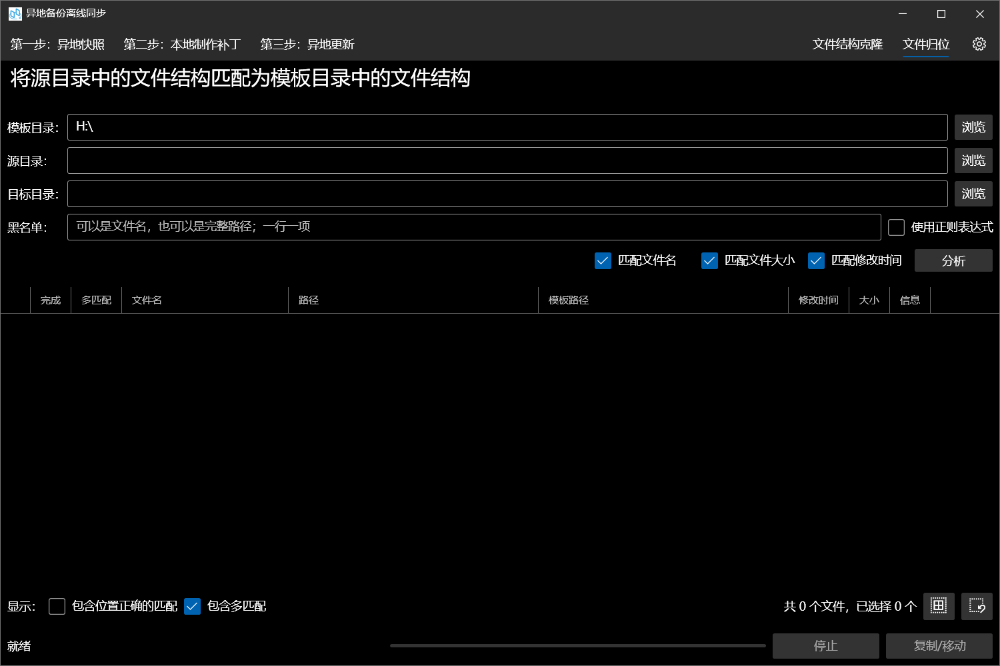

# 异地备份离线同步

在双方无法通过网络或实地同步的情况下，使用增量同步的方式，利用小容量设备完成异地和本地磁盘的数据同步

## 为谁开发？

- 如果你有重要数据，因此建立了异地备份
- 如果你的异地备份仅仅是单独放置、不连接网络的硬盘
- 如果你需要对异地备份硬盘需要进行定期同步，但又不想每次带着这些异地备份硬盘到本地来同步

## 步骤

1. **在异地**，建立异地硬盘的目录结构快照
2. **在本地**，将异地目录结构与本地进行对比，寻找差异部分，准备需要新增/更新/删除的文件
3. **在异地**，将更新文件应用到异地备份硬盘。

## 截图

## 日志

## 20220821

完成基本功能

## 20220822

优化第一步，改为设置目录后选择子目录

优化界面

修复了差异列表不更新的BUG

完善了空值、存在性等检测，增强茁壮性

进行了性能优化，提升了查找和对比文件的速度

## 20220827

新增支持删除和替换时可以选择将旧文件直接删除、移动到回收站或者移动到删除文件夹

新增支持黑名单

新增本地对比界面显示文件大小和数量，支持全选和全不选

## 20220901

新增支持记忆异地备份的文件夹

优化界面布局

## 20221023

优化了第二步和第三步的表格布局

## 20221024

新增同步时，将会在异地删除本地已经不存在的空目录

## 20221025

修复了删除本地已经不存在的空目录时，空目录内含空目录导致删除失败的BUG

优化了表格中的选择框

优化了表格下方的文件统计，能够跟着选择框的改变而改变

新增步骤3的全选和全不选按钮

## 20221102

新增支持创建补丁时选择硬链接

基本完成创建稀疏文件树功能

## 20221103~04

基本完成文件归位工具

## 20221105

整合了控制界面Enable的代码，全部改成MVVM绑定，使用Status进行控制

整合了在UserControl中对Utilities的事件注册

导出的目录或文件位置改为预先设置

新增调试时创建测试目录功能

优化代码和界面

## 20221107

修复了表格中选择框导致的报错问题

修复了一些关于进度条的BUG

## 20221115

修复了关于黑名单的一些错误

## 20221121

修复了异地重建时，分析阶段就会创建目录的BUG

新增文件更新类型：“移动”，支持在第二步寻找被移动或重命名的文件，并在第三步进行移动

## 20221204

修复了文件归位中，只能进行第一个匹配条件的匹配的BUG

## 20221217

修复了当A文件复制到了B处，然后A进行了修改时，会产生“修改”和“移动”两个更新项，若先修改后移动，则会出现冲突导致两方文件不统一的BUG

## 20221230

修改输出的补丁文件文件名为文件元数据特征码，而不是随机字符串，方便补丁的覆盖

新增每10秒自动保存当前配置

增加复制文件时的多次尝试防止（复制网络文件时）偶发错误